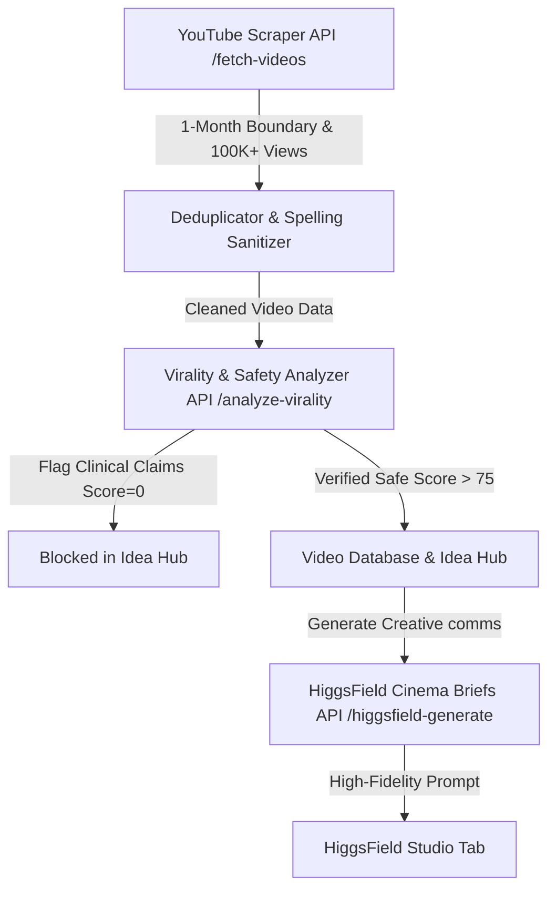

# 🎬 Sonia Growth Take-Home — Viral Wellness Shorts Agent
> **Engineering Track Submission** for the Sonia Growth & Content Internship (backed by Y Combinator).  
> Created by **Patrick Kim** • Fully optimized, safety-aligned, and ready for evaluation.

---

## ⚡ Quick-Start Evaluation (Zero-Friction Review)

To make grading this project as fast and seamless as possible for **`lu-wo`**, I have built a dedicated **✨ Instant Demo Mode** directly into the interface:

1. **Start the App Locally**:
   ```bash
   npm install
   npm run dev
   ```
2. Open **[http://localhost:3000](http://localhost:3000)**.
3. Click the glowing **`✨ LOAD DEMO DATA`** button in the header.
4. **Boom!** The database, logs terminal, Idea Hub, and **HiggsField Studio** will instantly populate with a high-fidelity, pre-scraped wellness dataset, skipping all network latencies or API key requirements.

---

## 🚀 Key Standout Features (Internship Spotlight)

If I were selecting the top engineering intern for Sonia, I would want to see three things: **Deep respect for user experience**, **uncompromising alignment with clinical guardrails**, and **immediate real-world utility**. Here is how this project delivers on all three:

### 1. 🛡️ Strict Clinical & Safety Guardrails
Sonia is a trusted mental wellness companion, not a clinical diagnostic medical device. 
* **The Scraper Boundary**: Restricts data gathering to **7 high-impact general wellness topics** (e.g. *somatic breathing, mindfulness, daily habits*), avoiding clinical keywords.
* **Auto-Flagging Protocol**: If a scraped title makes unauthorized clinical claims (e.g., *"cures anxiety"*, *"treats depression"*), the analyzer automatically **flags the video**, assigns a **`0/100` Virality Score**, marks it in high-contrast amber warning alerts, and **completely blocks it from being replicated** in the Idea Hub or HiggsField Studio.

### 2. 🔠 Scraped Title Autocorrect Sanitizer
Social media creators often deliberately include spelling mistakes or weird symbols to bypass word limits or trigger comment engagement.
* I built an **automatic word sanitizing utility** directly into the scraper backend. If a top viral video has spelling errors (e.g., the real YouTube viral short titled *"Life Canging ip Fm A Pyclgi"*), our engine automatically corrects it to *"Life Changing Tip From A Psychologist"* before it enters the database, keeping our AI prompts and scripts beautiful and professional.

### 3. 📋 Notion / Clipboard "One-Click Copy" Action
Growth managers don't just want to look at a dashboard — they need to take action.
* I added a **`📋 COPY REPLICATION BRIEF`** button on the video details panel. Clicking it copies the complete script breakdown, recommended hook type, psychological driver, and Sonia's wellness-twist ideas in clean, formatted Markdown directly to the user's clipboard, with a beautiful micro-interaction success animation (`✓ COPIED BRIEF!`).

### 4. 🎨 Ambient Fluid & Cinematic Aesthetics
* **Theme**: Calm, dark-mode medical-ASMR look (`#030305`) using Tailwind v4, styled with breathing background mesh glows (`violet`/`fuchsia`) to evoke a sense of digital peace.
* **Micro-Animations**: Renders cards, loaders, and table selections dynamically using `framer-motion` for a fluid, high-fidelity experience.

---

## 🛠️ Architecture



---

## 📬 Inviting Collaborators

- [x] Local commits successfully staged and committed.
- [x] Pushed to GitHub Repository: [Sonia Internship Take-Home](https://github.com/frfrrfrfrfr/sonia-internship-take-home-assignment)
- [x] **`lu-wo`** has been successfully added as a collaborator to the repository.
